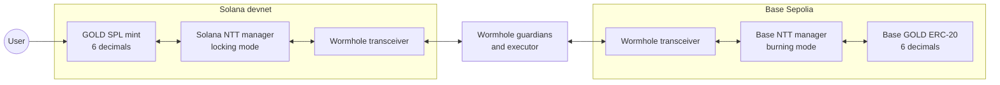
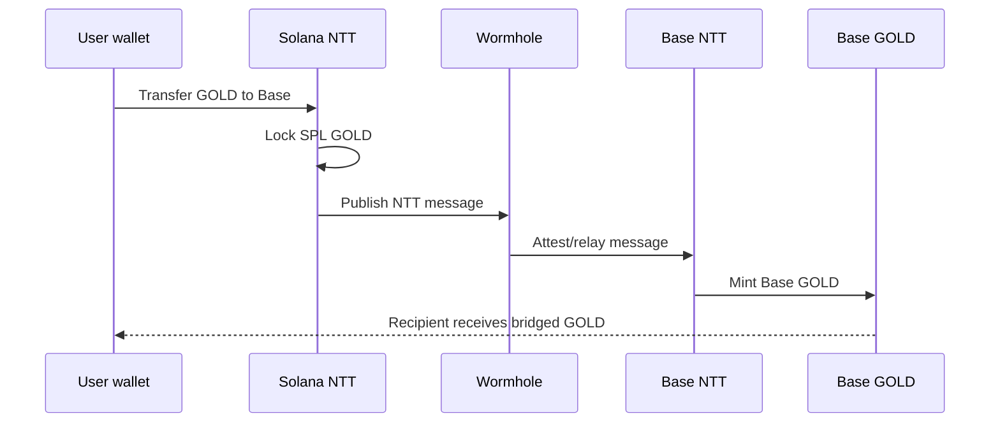
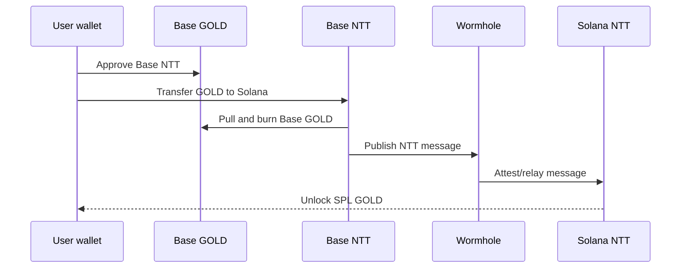

# GOLD bridge testnet runbook

This is the short path for proving Solana GOLD can bridge to Base with Wormhole NTT.

## Shape

Solana is canonical. Its NTT manager runs in locking mode. Base is the spoke chain. Its GOLD ERC-20 runs at 6 decimals and the Base NTT manager runs in burning mode.



## Commands

1. Fill `.env` from `.env.template`.
2. Install/check tools:

```bash
pnpm doctor
```

3. Before a fresh rehearsal, snapshot and prepare local state from the cockpit Guide tab, or run:

```bash
pnpm rehearsal:snapshot
pnpm rehearsal:prepare-fresh
pnpm doctor
```

`rehearsal:prepare-fresh` snapshots first, moves the current NTT project aside, clears deployment-derived env keys, and empties ignored artifacts. It preserves the Solana mint, RPCs, keys, token name/symbol, timelock config, and other operator inputs.

4. Deploy upgradeable Base GOLD and copy the printed proxy, implementation, timelock, and ProxyAdmin addresses into `.env`:

```bash
pnpm deploy:base-token
```

5. Initialize NTT and add both chains:

```bash
pnpm ntt:init
pnpm ntt:overrides
pnpm ntt:add-solana
pnpm ntt:add-base
```

6. Edit `deployment.json` rate limits, then push config and schedule minting handoff:

```bash
pnpm ntt:push
pnpm ntt:addresses
pnpm base:set-minter
pnpm timelock:execute
pnpm preflight
pnpm web:export-config
```

On testnet only, `TIMELOCK_EXECUTE_IMMEDIATELY=true pnpm base:set-minter` is acceptable when the timelock delay is zero.

7. Prove both directions:

```bash
TEST_TRANSFER_SOURCE_CHAIN=Solana \
TEST_TRANSFER_DESTINATION_CHAIN=BaseSepolia \
TEST_TRANSFER_AMOUNT=1 \
TEST_TRANSFER_DESTINATION_ADDRESS=<base-wallet> \
pnpm ntt:test-transfer

TEST_TRANSFER_SOURCE_CHAIN=BaseSepolia \
TEST_TRANSFER_DESTINATION_CHAIN=Solana \
TEST_TRANSFER_AMOUNT=0.5 \
TEST_TRANSFER_DESTINATION_ADDRESS=<solana-wallet> \
TEST_TRANSFER_DESTINATION_MSG_VALUE=10000000 \
pnpm ntt:test-transfer
```

## Transfer flow





## Testnet proof from this repo

- Solana GOLD mint: `6NLCfbAzMyykwjwifAZr8WRBTPsb8u5s1uAVvGBGGa4r`
- Solana NTT manager: `DQAKHw5eimsucy37oTgwRWCEBrJhyfht6Z6YPx6ut4hH`
- Solana Wormhole transceiver: `81fVCz1fVChbZkqgmzFkudVuaAMDkTrK2gTWwNLi2k7M`
- Base GOLD proxy token: `0xF6F49EAf9EA71e69450191aFe22EFaed8E2f7995`
- Base GOLD implementation: `0x6A5DD88cd7dF0D6FD9478c6E451E5Ef6309DaC4c`
- Base GOLD timelock: `0x686f671F2276127d52d294bC0E981C89FDA25C34`
- Base GOLD ProxyAdmin: `0x9381505b073bacc179c35c91a05390c5486ff594`
- Base NTT manager: `0x2B602BbF837Bd845Cc8b40AE70Dc6AB5b191eF3c`
- Base Wormhole transceiver: `0x9a683a5464aCf816dc5e87F8686828f063e54104`

Proof txs:

- Base GOLD proxy deploy helper tx: `0xd9c5d05c40f30761546399faa8c08ce216901e3e83b69251eadba84d35a15ac2`
- Base timelock minter handoff execute tx: `0xdc56f13fed35eee612510fcab2e62236e2659b89e44a963e9a1cc7af91141fbd`
- Solana -> Base: `4VZjBLoxG3yrqRiG9SYevzVfgRHhGDf4beXMntpvyr79ssD2Bgh8R7L8DpUmYhxxUsLiwHsFXEUieZTSfw1hsqx1`
- Base -> Solana approve: `0xf51fd022743cfe0a7101ffcf16bcca87914999cddcfc0e8a01131ee3b8e7f7c2`
- Base -> Solana transfer: `0xd62c3970e3852719bc7e0963324227a2f7bb4dc25dc932e3f88ff10dc3f7ede0`

## Gotchas

- Keep deployment artifacts and private keys out of git.
- `ntt new` refuses to scaffold inside an existing git repo, so use an ignored/external `NTT_PROJECT_DIR`.
- The Solana package pinned Solana CLI `1.18.26` and Anchor `0.29.0`.
- Base add-chain may need to continue without simulation on testnet even when `decimals()` works on-chain.
- Base -> Solana needs `TEST_TRANSFER_DESTINATION_MSG_VALUE` for executor rent/gas.
- Fresh Solana NTT program deployment needed more than 6 SOL after build; keep the payer above that before `pnpm ntt:add-solana`.
- Even with zero delay, the timelock execute call may need to happen after the next block rather than in the same script invocation.
- Base -> Solana VAA lookup can take most of the CLI wait window; the transfer can still complete after many retries.
